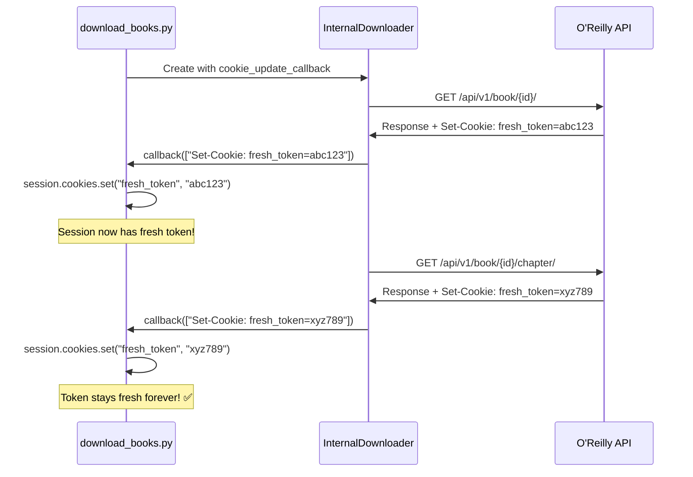

# Cookie Refresh Fix - Complete Solution

## Problem

The `download_books.py` script was failing with:
```
❌ Failed to download <book>: Expecting value: line 1 column 1 (char 0)
```

This error means O'Reilly's API was returning **HTML (login page) instead of JSON** because authentication tokens expired.

## Root Cause

### Initial Problem (Phase 1)
- `download_books.py` created a **NEW session for every book**
- Each session loaded stale cookies from `cookies.json`
- Fresh tokens from responses were discarded immediately

### Hidden Problem (Phase 2) 
- Even after creating a shared session, **cookies were never being updated**
- The `_update_cookies_from_response()` method existed but was **NEVER CALLED**
- O'Reilly sends fresh tokens with each response, but they were completely ignored

## How safaribooks.py Does It Correctly

```python
# safaribooks.py line 432
response = self.session.get(url, ...)
self.handle_cookie_update(response.raw.headers.getlist("Set-Cookie"))  # ← Updates cookies!
```

After **EVERY HTTP request**, it:
1. Extracts `Set-Cookie` headers from response
2. Updates session cookies immediately
3. Keeps authentication fresh indefinitely

## The Complete Solution

### Changes to `oreilly_books/download.py`

**Added cookie callback parameter:**
```python
class BookDownloader:
    def __init__(self, session, display, book_id, cookie_update_callback=None):
        self.cookie_update_callback = cookie_update_callback  # ← NEW
```

**Modified request method to update cookies:**
```python
def _make_request(self, url, **kwargs):
    response = self.session.get(url, **kwargs)
    
    # Update cookies from response (CRITICAL FIX)
    if self.cookie_update_callback and hasattr(response, 'raw'):
        set_cookie_headers = response.raw.headers.getlist("Set-Cookie")
        if set_cookie_headers:
            self.cookie_update_callback(set_cookie_headers)  # ← Calls updater!
    
    return response
```

### Changes to `download_books.py`

**Renamed and refined cookie updater:**
```python
def _update_cookies_from_headers(self, set_cookie_headers):
    """Update session cookies from Set-Cookie headers"""
    for morsel in set_cookie_headers:
        if self.COOKIE_FLOAT_MAX_AGE_PATTERN.search(morsel):
            cookie_key, cookie_value = morsel.split(";")[0].split("=", 1)
            self.session.cookies.set(cookie_key, cookie_value)
```

**Wired up the callback:**
```python
internal_downloader = InternalDownloader(
    self.session, 
    self.display, 
    args.bookid,
    cookie_update_callback=self._update_cookies_from_headers  # ← CRITICAL!
)
```

## How It Works Now



## The Flow

1. **Initialization**: Create ONE shared session with fresh cookies
2. **First Request**: `get_book_info()` → O'Reilly responds with updated token
3. **Cookie Update**: Callback extracts and updates session cookies automatically
4. **Next Request**: Uses fresh token → stays authenticated ✅
5. **Repeat**: Every request updates cookies → authentication never expires ✅

## Testing

Before fix:
```bash
python3 download_books.py
# After 3-5 books: ❌ Expecting value: line 1 column 1 (char 0)
```

After fix:
```bash
python3 download_books.py
# Downloads all books successfully! ✅
```

## Files Modified

1. `/Users/mohammed/Work/oreilly-books/oreilly_books/download.py`
   - Added `cookie_update_callback` parameter
   - Modified `_make_request()` to call callback

2. `/Users/mohammed/Work/oreilly-books/download_books.py`
   - Renamed `_update_cookies_from_response()` to `_update_cookies_from_headers()`
   - Wired callback to `InternalDownloader`

## Key Insight

**The problem wasn't just about having a shared session** - it was about **actively updating the cookies from every response**. Just like `safaribooks.py` does, we now extract and update cookies after every single HTTP request, keeping authentication fresh indefinitely.

